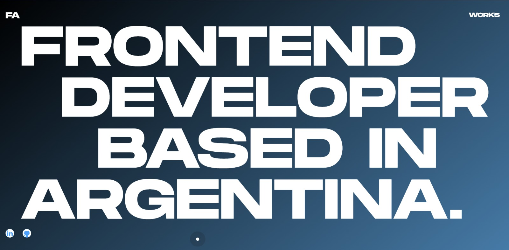

# Personal Portfolio
This project was created to show my personal projects, with which technologies I created them, information about me so you can get to know me and how to contact me.





## Demo

This project is deployed on [vercel](https://vercel.com/)

[View live portfolio](https://feralarcon.vercel.app/)
## Installation

Install portfolio with npm

```bash
  npm install portfolio
  cd portfolio
  npm run dev
```

    
## Tech Stack

**Client:** 
- Vite v4.0.0
- React (JSX) v18.2.0
**Styles:** 
- StyleComponent v5.3.6
**Librarys:**  
- FramerMotion  v8.5.0
- LocomotiveScroll v4.1.4
- React-router-dom v6
- Hover-effect v1.1.0
- Swiper v8.4.6


## Contact Me
[](https://feralarcon.vercel.app/)
[](https://www.linkedin.com/in/feralarcon1995/)
[](https://twitter.com/)


